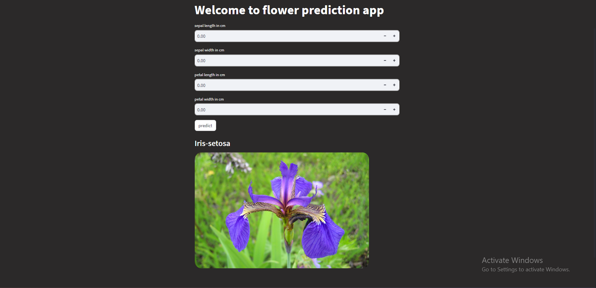

<h1>This is our first team project done together by:</h1>

Ayush Khadka

Sushant Phuyal

Ashim Pandey

Sunil Phal Magar

 

Flower Predection Web App

 

<h2>Requirements</h2>
 
1 - <code>pip install streamlit</code> 
2 - <code>pip install numpy</code> 
3 - <code>pip install keras</code> 

<h2>How to Run</h2>
1 - Download the Repository 
2 - Run coomand <code>streamlit run app.py</code> 
And the browser will open running this app 
